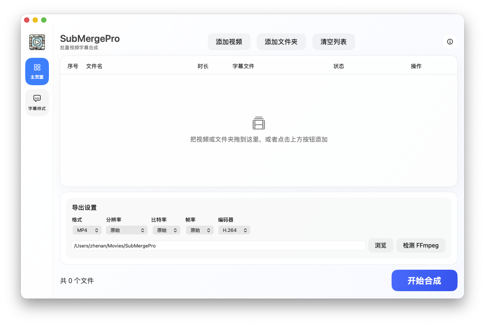
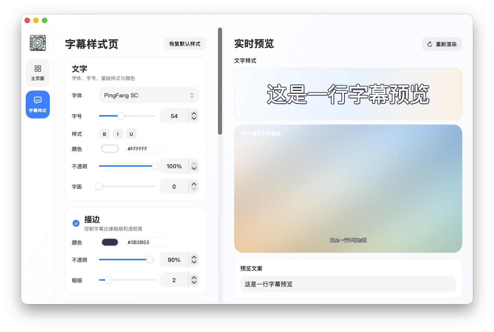

# SubMergePro

SubMergePro 是一个面向 macOS 的字幕压制工具，用 SwiftUI 重写自早期的 Python 版本。它可以批量导入视频，自动匹配同名字幕，并通过 FFmpeg 将字幕烧录到视频中。


| 主界面 | 字幕样式 |
| --- | --- |
|  |  |

## 功能

- 批量添加视频文件或整个文件夹
- 自动匹配同名 `.srt` 字幕
- 支持单个视频导出和批量导出
- 可统一设置输出格式、分辨率、码率、帧率和编码器
- 可调整字幕字体、字号、颜色、描边、阴影、位置和背景
- 内置字幕样式预览和视频预览帧
- 导出后可直接打开输出文件位置
- 显示视频时长、分辨率、帧率、码率和文件大小

## 系统要求

- macOS 13.0 或更高版本
- Xcode 16 或更高版本
- FFmpeg

安装 FFmpeg：

```bash
brew install ffmpeg
```

应用会依次查找这些位置：

- 应用包内的 `ffmpeg`
- 当前环境变量 `PATH`
- `/opt/homebrew/bin/ffmpeg`
- `/usr/local/bin/ffmpeg`
- `/usr/bin/ffmpeg`

## 开发

用 Xcode 打开：

```bash
open SubMergeProMac.xcodeproj
```

在 Xcode 中选择 `SubMergeProMac` scheme，然后点击运行。

也可以用命令行编译：

```bash
xcodebuild \
  -project SubMergeProMac.xcodeproj \
  -scheme SubMergeProMac \
  -configuration Debug \
  -destination 'platform=macOS' \
  build
```

Swift Package Manager 也可以用于快速检查源码编译：

```bash
swift build
```

常用命令也可以走 `make`：

```bash
make doctor
make build
make test
make xcode-build
```

维护者发布流程、FFmpeg 分发说明和后续计划分别见 [docs/RELEASING.md](docs/RELEASING.md)、[docs/FFMPEG.md](docs/FFMPEG.md) 和 [docs/ROADMAP.md](docs/ROADMAP.md)。

## 项目结构

```text
App/              应用入口和窗口配置
Models/           数据模型和导出配置
Services/         FFmpeg、字幕转换、预览、视频元数据服务
ViewModels/       页面状态和业务流程
Views/            SwiftUI 页面和控件
Resources/        Info.plist、图标和资源
scripts/          本地构建、发版、版本管理脚本
docs/             发布、FFmpeg 和路线图文档
.github/          GitHub Actions 和协作模板
```

## 参与贡献

欢迎提交 issue 和 pull request。提交 PR 前请先确认：

```bash
swift build
swift test
xcodebuild -project SubMergeProMac.xcodeproj -scheme SubMergeProMac -configuration Debug -destination 'platform=macOS' build
```

更多约定见 [CONTRIBUTING.md](CONTRIBUTING.md)。

## 许可证

本项目使用 MIT License，详见 [LICENSE](LICENSE)。
